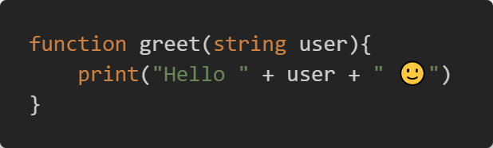

# ASPL for Visual Studio Code

This Visual Studio Code extension contains syntax highlighting, many useful snippets, and a few commands for writing programs in [the ASPL programming language](https://github.com/aspl-lang).

## Features

- Syntax highlighting
- Code snippets
- Version, compile and run commands

## Installing

This extension has not been released to the marketplace yet, which is why you manually have to download and then move it to the `.vscode/extensions` folder in your home directory.
